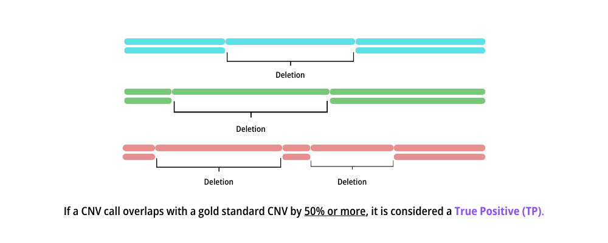
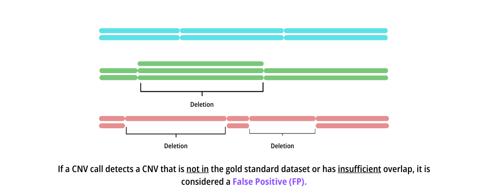
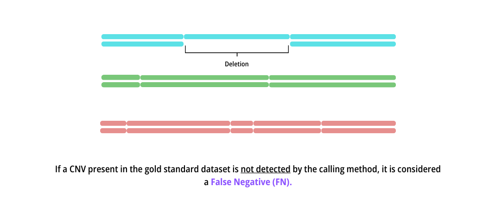

<a id="readme-top"></a>

[![Contributors][contributors-shield]][contributors-url] [![Forks][forks-shield]][forks-url] [![Stargazers][stars-shield]][stars-url] [![Issues][issues-shield]][issues-url] [![Unlicense License][license-shield]][license-url] [![LinkedIn][linkedin-shield]][linkedin-url]


# SNP Tool Comparison

This tool evaluates the performance of copy number variation (CNV) calling methods from three software platforms—**GenomStudio**, **NxClinical**, and a **Custom Software**—by comparing their CNV calls against a gold standard dataset derived from the **1000 Genomes Project**. It quantifies how well the CNV calls from these tools overlap with the reference CNVs, classifying them into True Positives (TP), False Positives (FP), and False Negatives (FN) based on predefined criteria.

## CNV Classification Criteria

<p align="center"> <b> True Positive (TP) </b> </p>
<p align="center">  </p>
<p align="center"> If a CNV call overlaps with a gold standard CNV by 50% or more, it is considered a <b> <i> True Positive (TP). </i> </b> </p>

<p align="center"> <b> False Positive (FP) </b> </p>
<p align="center">  </p>
<p align="center"> If a CNV call detects a CNV that is not in the gold standard dataset or has insufficient overlap (less than 50%), it is considered a <b> <i> False Positive (FP). </i> </b> </p>

<p align="center"> <b> False Negative (FN) </b></p>
<p align="center">  </p>
<p align="center"> If a CNV present in the gold standard dataset is not detected by the calling method, it is considered a <i><b>False Negative (FN).</b></i> </p>

## Statistical Performance Metrics

<p align="center"> There are some statistical parameters to measure performance: </p>
<p align="center"> <b>Recall</b> = TP / (TP + FN) </p>
<p align="center"> <b>Precision</b> = TP / (TP + FP) </p>
<p align="center"> <b>F1-Score</b> = 2 * (Precision * Recall) / (Precision + Recall) </p>
<p align="center"> These metrics—Recall (also called sensitivity), Precision, and F1-Score—can be calculated to assess how well each tool balances detecting true CNVs while avoiding errors. </p>

## Usage

### Running Locally with Nextflow
To run the tool locally using Nextflow, execute the following command from the project directory:
```bash
nextflow run main.nf
